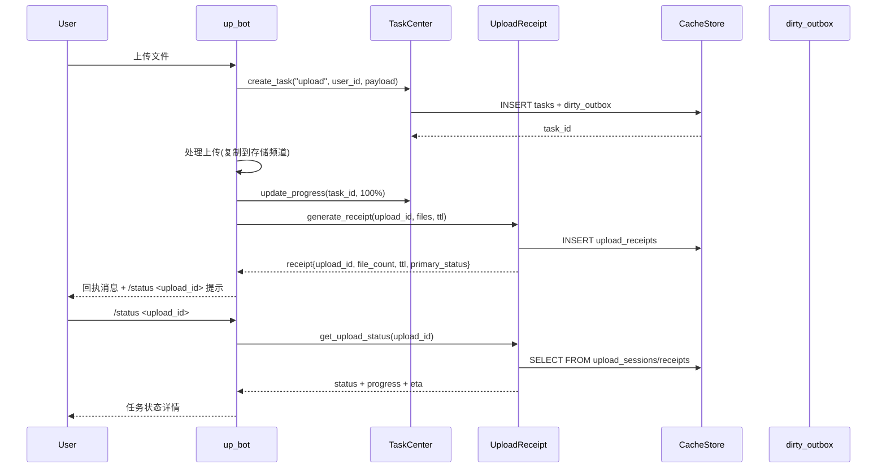
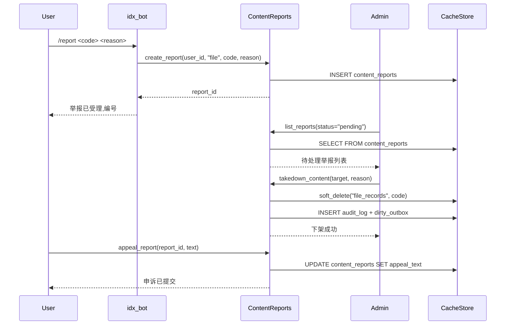
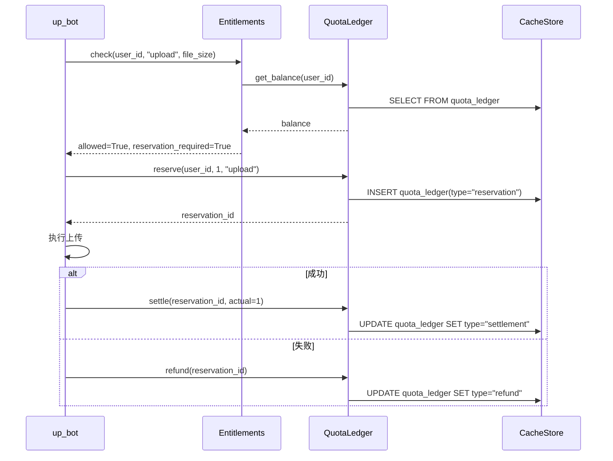
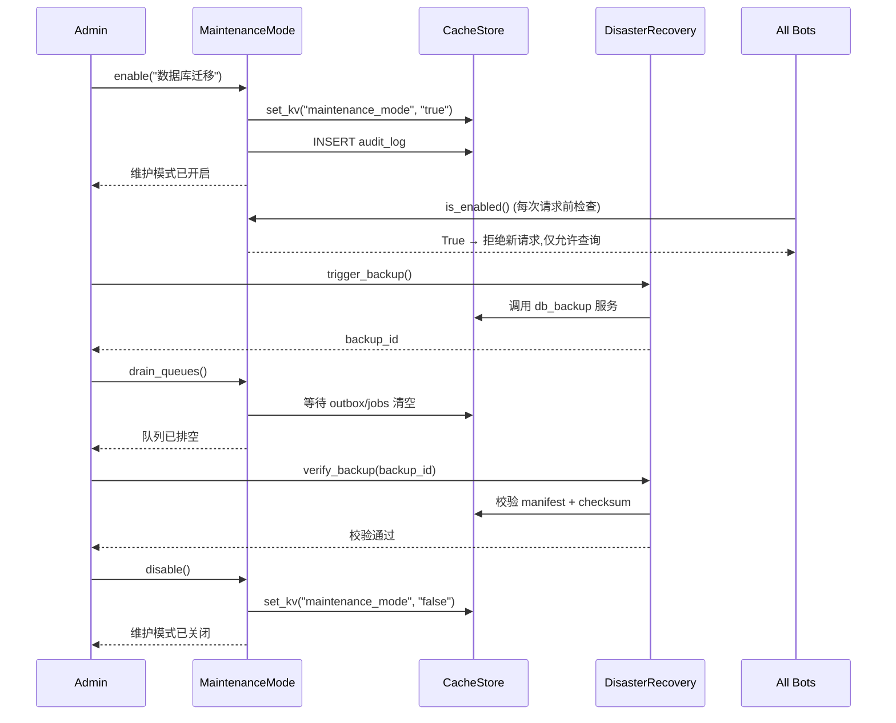

# R40 产品功能整体优化 — 系统设计文档

> 基于 R39 §9 产品功能整体优化建议,实现 17 项功能(5 用户体验 + 3 内容安全 + 4 商业化权限 + 5 管理运维)
>
> HEAD 基线: `2211275`(R39 整改完成)

## 1. 实现方案与框架选型理由

### 1.1 总体策略
- **本地权威**: 所有新功能数据落 SQLite(`database/cache_store.py` 扩展),零 CRDB 空载 RU
- **CRDB 镜像**: 仅 `tasks`/`collections`/`reports`/`audit_log`/`quota_ledger` 等跨机数据经 `dirty_outbox` 同步
- **Bot 集成**: 新命令注册到现有 `up_bot`/`idx_bot`/`dsp_bot`/`admin_bot`,不新增独立 Bot 进程
- **Admin Web**: 新管理页面加到 `admin/__init__.py`,复用 CSRF + Argon2id + CSP nonce
- **服务层**: 新服务放 `services/`,纯函数式 + async,不持有全局状态

### 1.2 框架复用
- 数据库: 复用 `database/cache_store.py` 的 `CacheStore` 单例 + `add_dirty_outbox` 事务发件箱
- 通知: 复用 `pending_notify`/`dsp_notify` 跨进程通知机制
- 软删除: 复用 `soft_delete()` API(R39 P1-5)
- 配额: 扩展 `quota_ledger` 表(M1 已有),增加 reservation/refund 流水
- RBAC: 复用 `users_local.membership_level` + 新增 `rbac_roles`/`rbac_role_permissions`
- 监控: 复用 `prometheus_exporter` + `bot_heartbeat`

## 2. 完整文件列表(相对路径)

### 2.1 数据库扩展
- `database/cache_store.py` (修改): 新增 12 张表 + 相关方法
- `services/migration_runner.py` (修改): 新表 schema 验证

### 2.2 用户体验模块(5 项)
- `services/task_center.py` (新增): 统一任务中心
- `services/upload_receipt.py` (新增): 上传回执
- `services/collections.py` (新增): 文件集合与目录
- `services/notifications.py` (新增): 可靠通知
- `services/user_repair.py` (新增): 用户自助修复
- `bots/up_bot.py` (修改): 集成上传回执 + 任务中心
- `bots/idx_bot.py` (修改): 集成自助修复 + 任务中心 + 集合
- `bots/dsp_bot.py` (修改): 集成通知 + 任务中心

### 2.3 内容安全与合规(3 项)
- `services/content_reports.py` (新增): 举报、下架、封禁、申诉
- `services/content_policy.py` (新增): 文件类型/大小/恶意内容策略插件
- `services/data_lifecycle.py` (新增): 数据导出、删除、保留期、管理员访问日志
- `bots/idx_bot.py` (修改): 集成举报命令
- `bots/dsp_bot.py` (修改): 集成举报按钮
- `bots/admin_bot/handlers.py` (修改): 集成下架/封禁审批

### 2.4 商业化与权限(4 项)
- `services/entitlements.py` (新增): 套餐/配额/并发/文件大小/保留期/优先队列统一判定
- `services/quota_ledger.py` (新增): reservation/settlement/refund ledger
- `services/rbac.py` (新增): 角色/权限/分权
- `services/approval_workflow.py` (新增): 高风险操作二次确认/审批/审计
- `bots/up_bot.py` (修改): 集成 entitlement 校验
- `bots/admin_bot/handlers.py` (修改): 集成 RBAC + 审批

### 2.5 管理与运维(5 项)
- `services/repair_console.py` (新增): Outbox/DLQ/Replication/Relay Repair Console
- `services/topology_view.py` (新增): 拓扑可视化
- `services/ru_cost_center.py` (新增): RU 成本中心
- `services/maintenance_mode.py` (新增): 一键维护模式
- `services/disaster_recovery.py` (新增): 灾备控制台
- `admin/__init__.py` (修改): 新增 12 个管理页面路由
- `services/prometheus_exporter.py` (修改): 新增指标

### 2.6 测试
- `tests/test_r40_user_experience.py` (新增)
- `tests/test_r40_content_security.py` (新增)
- `tests/test_r40_commercial.py` (新增)
- `tests/test_r40_admin_ops.py` (新增)

## 3. Mermaid classDiagram — 数据结构 + 接口

```mermaid
classDiagram
    class CacheStore {
        +init() async
        +create_task(task_type, user_id, payload) int
        +update_task_status(task_id, status, progress) bool
        +get_user_tasks(user_id, limit) list
        +create_collection(name, owner_id) int
        +add_to_collection(collection_id, file_codes) bool
        +create_notification(user_id, type, payload) int
        +create_report(reporter_id, target_type, target_id, reason) int
        +soft_delete(table, pk, deleted_at) bool
        +create_audit_log(actor_id, action, target, details) int
        +reserve_quota(user_id, amount, reason) str
        +settle_quota(reservation_id, actual) bool
        +refund_quota(reservation_id) bool
        +upsert_rbac_role(name, permissions) int
        +assign_role(user_id, role_id) bool
        +create_approval(action, approver_id, payload) int
        +set_maintenance_mode(enabled, reason) bool
    }

    class TaskCenter {
        +create_task(task_type, user_id, payload) int
        +update_progress(task_id, percent, eta) bool
        +complete_task(task_id, result) bool
        +fail_task(task_id, reason) bool
        +get_task(task_id) dict
        +list_user_tasks(user_id, status) list
    }

    class UploadReceipt {
        +generate_receipt(upload_id, user_id, files, ttl) dict
        +get_receipt(upload_id) dict
        +get_upload_status(upload_id) str
    }

    class Collections {
        +create_collection(name, owner, description) int
        +add_files(collection_id, file_codes) bool
        +remove_files(collection_id, file_codes) bool
        +list_collections(user_id) list
        +get_collection(code) dict
        +update_version(collection_id) int
    }

    class Notifications {
        +send(user_id, type, payload) int
        +mark_read(notif_id) bool
        +list_unread(user_id) list
        +broadcast(type, payload) int
    }

    class UserRepair {
        +reindex_code(file_code) bool
        +regenerate_code(old_code) str
        +get_failure_reason(file_code) dict
    }

    class ContentReports {
        +create_report(reporter, target, reason) int
        +takedown_content(target, reason) bool
        +ban_user(user_id, reason, duration) bool
        +appeal_report(report_id, user_id, text) bool
        +list_reports(status) list
    }

    class ContentPolicy {
        +check_file(file_meta) PolicyResult
        +register_plugin(name, handler) bool
        +list_plugins() list
    }

    class DataLifecycle {
        +export_user_data(user_id) str
        +delete_user_data(user_id) bool
        +set_retention(user_id, days) bool
        +log_admin_access(admin_id, action, target) int
    }

    class Entitlements {
        +check(user_id, action, resource) EntitlementResult
        +get_plan(user_id) Plan
        +get_quota(user_id) Quota
        +get_limits(user_id) Limits
    }

    class QuotaLedger {
        +reserve(user_id, amount, reason) str
        +settle(reservation_id, actual) bool
        +refund(reservation_id) bool
        +get_balance(user_id) int
    }

    class RBAC {
        +create_role(name, permissions) int
        +assign_role(user_id, role_id) bool
        +check_permission(user_id, permission) bool
        +list_roles() list
    }

    class ApprovalWorkflow {
        +create_approval(action, payload) int
        +approve(approval_id, approver_id) bool
        +reject(approval_id, approver_id, reason) bool
        +list_pending() list
    }

    class RepairConsole {
        +list_outbox(status) list
        +retry_outbox(ids) bool
        +skip_outbox(ids) bool
        +list_dlq() list
        +replay_dlq(ids) bool
        +list_replication_failures() list
        +repair_relay(account_id) bool
    }

    class TopologyView {
        +get_topology() dict
        +get_channel_health() list
        +get_account_risk() list
        +get_r100_delay() int
    }

    class RUCostCenter {
        +record_usage(service, amount) bool
        +get_daily_report(date) dict
        +get_cost_by_service(start, end) dict
        +get_cost_per_1k(service) float
    }

    class MaintenanceMode {
        +enable(reason) bool
        +disable() bool
        +is_enabled() bool
        +get_status() dict
        +drain_queues() bool
    }

    class DisasterRecovery {
        +list_backups(limit) list
        +get_backup_info(backup_id) dict
        +trigger_backup() str
        +verify_backup(backup_id) bool
        +restore(backup_id) bool
        +get_rpo_rto() dict
    }

    CacheStore --> TaskCenter
    CacheStore --> Collections
    CacheStore --> Notifications
    CacheStore --> ContentReports
    CacheStore --> QuotaLedger
    CacheStore --> RBAC
    CacheStore --> ApprovalWorkflow
```

## 4. Mermaid sequenceDiagram — 关键调用流程

### 4.1 上传回执 + 任务中心流程

### 4.2 举报 → 下架 → 申诉流程

### 4.3 配额 reservation/settlement/refund 流程

### 4.4 维护模式 + 灾备恢复流程

## 5. 任务列表(≤5,按依赖排序)

### 任务 1: 基础设施 — SQLite schema 扩展
**文件**:
- `database/cache_store.py`(新增 12 张表 + 方法)
- `services/migration_runner.py`(schema 验证)

**内容**:
新增表: `tasks` / `collections` / `collection_items` / `notifications` / `content_reports` / `audit_log` / `quota_reservations` / `rbac_roles` / `rbac_user_roles` / `approvals` / `maintenance_state` / `admin_access_log`

### 任务 2: 用户体验模块(5 项)
**文件**:
- `services/task_center.py` / `services/upload_receipt.py` / `services/collections.py` / `services/notifications.py` / `services/user_repair.py`
- `bots/up_bot.py` / `bots/idx_bot.py` / `bots/dsp_bot.py`(集成)

### 任务 3: 内容安全与合规(3 项)
**文件**:
- `services/content_reports.py` / `services/content_policy.py` / `services/data_lifecycle.py`
- `bots/idx_bot.py` / `bots/dsp_bot.py` / `bots/admin_bot/handlers.py`(集成)

### 任务 4: 商业化与权限(4 项)
**文件**:
- `services/entitlements.py` / `services/quota_ledger.py` / `services/rbac.py` / `services/approval_workflow.py`
- `bots/up_bot.py` / `bots/admin_bot/handlers.py`(集成)

### 任务 5: 管理与运维 + 测试(5 项 + 测试)
**文件**:
- `services/repair_console.py` / `services/topology_view.py` / `services/ru_cost_center.py` / `services/maintenance_mode.py` / `services/disaster_recovery.py`
- `admin/__init__.py`(12 个新路由)
- `services/prometheus_exporter.py`(新指标)
- `tests/test_r40_*.py`(4 个测试文件)
