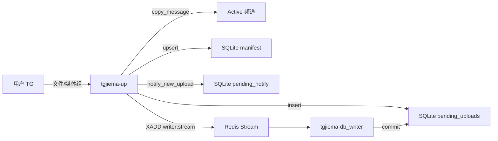
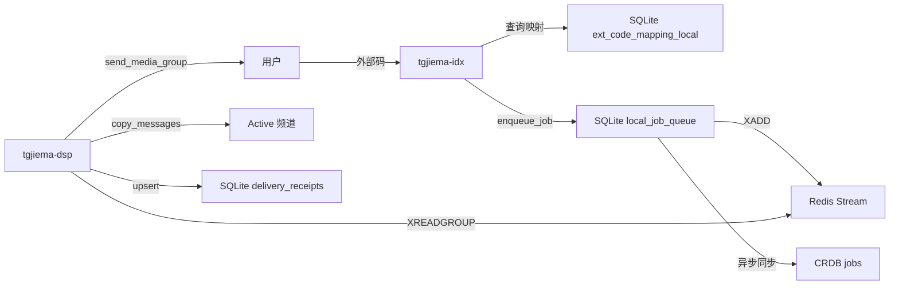
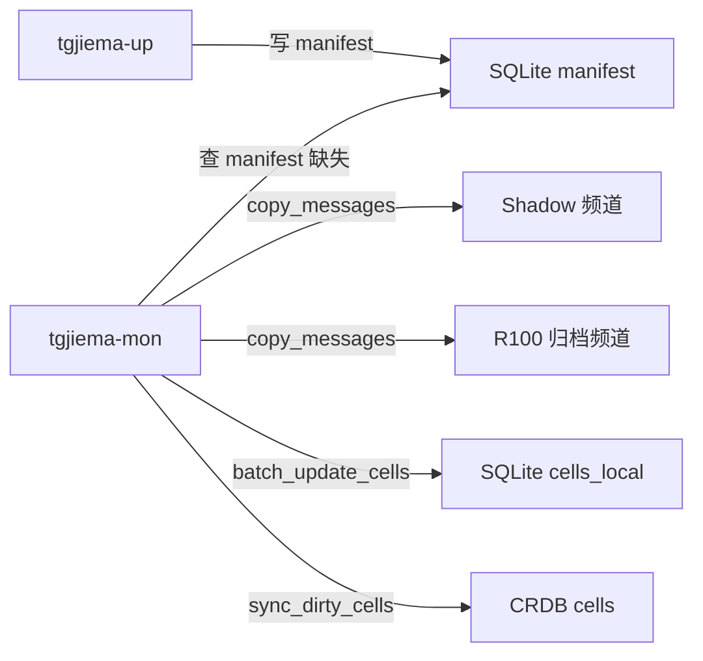
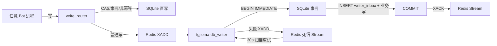

# tgjiema 架构文档(单一事实源)

> 最后更新: 2026-07-12 | DDL_VERSION: 7
> 注意: HEAD SHA 由 CI 自动注入,本文档不硬编码易过期的 commit SHA;
> 如需查询当前 HEAD,请运行 `git rev-parse HEAD`。

## 1. 系统概览

**一句话定位**:tgjiema 是一个基于 Telegram 频道冗余环的文件存储/解码/分发平台,采用 SQLite-WAL 本地热路径 + CockroachCloud 审计双写 + Redis Streams 可靠写入的分层架构。

**技术栈**:
- Python 3.10+(运行时),aiosqlite + sqlite3(本地热路径)
- Telethon/Pyrofork + python-telegram-bot(Bot 客户端)
- redis.asyncio + Redis Streams Consumer Group(可靠队列)
- asyncpg + CockroachDB Cloud(权威审计源)
- Cloudflare R2 + S3-compatible SDK(异地备份)
- systemd(进程编排)+ Cloudflare Workers(file_bot 边缘入口)

## 2. 运行组件(8 个 systemd 服务)

| 服务名 | 职责 | 主要依赖 | 健康检查 |
|--------|------|---------|---------|
| `tgjiema-up` | 上传接收 Bot,文件转发到 Active 槽,写 manifest | Telegram / SQLite(cells_local, manifest) / CRDB(pending_uploads) | bot_heartbeat 表 |
| `tgjiema-idx` | 解码索引 Bot,生成文件码,解码外部码,写 jobs 派工表 | Telegram / SQLite(codes_local, local_job_queue) / CRDB(file_records) / RelayPool | bot_heartbeat 表 |
| `tgjiema-dsp` | 派送分发 Bot,从 local_job_queue 拉取任务,通过 delivery_resolver 投递 | Telegram / SQLite(local_job_queue, delivery_receipts) / Redis Stream(`tgjiema:writer:stream`) | bot_heartbeat + jobs pending 数 |
| `tgjiema-mon` | 频道健康监控、Shadow 同步、轮转/降级、备用池补充 | Telegram / SQLite(cells_local) / CRDB(cells, spare_pool, rotate_log) / R2 | heartbeat_local 表 + cells 心跳 |
| `tgjiema-admin_bot` | 管理员 Bot 配置/重置/中继账号/白名单管理 | Telegram / CRDB(backup_config, relay_accounts) / SQLite(relay_pool.db) | bot_heartbeat 表 |
| `tgjiema-admin` | FastAPI Web 管理后台(uvicorn) | CRDB(全表只读) / SQLite(bot_heartbeat) | HTTP :8080/health |
| `tgjiema-db_backup` | 定期(默认 360min)备份 CRDB 核心表到 R2 | CRDB(fetch) / R2(S3 PUT) | last_backup_at(backup_config) |
| `tgjiema-db_writer` | 消费 Redis Stream 串行落盘 SQLite + DLQ 重试闭环 | Redis(硬依赖, Requires=redis.service) / SQLite(cache_store.db) | redis_queue.health_check() |

聚合单元:`tgjiema.target`(Wants=8 个子服务,一键启停)

## 3. 数据流图(Mermaid)

### 3.1 用户上传链

### 3.2 外部码解码链

### 3.3 副本同步链

### 3.4 持久化链(SQLite First → CRDB 异步审计)

## 4. 故障域分析

| 组件 | 故障影响 | 恢复策略 |
|------|---------|---------|
| Redis 单点 | db_writer 无法消费;新写入降级 SQLite 直写(60s 重试节流) | systemd Restart=on-failure;AOF+everysec 持久化;崩溃后 XAUTOCLAIM 回收 pending |
| cache_store.db | 跨进程通信断;热路径缓存全失效 | WAL 自动 checkpoint;损坏时 init() 自动删除重建,从 CRDB 全量重载 |
| relay_pool.db | 中继账号池不可用 | WAL;损坏自动删除重建;从 CRDB relay_accounts 同步恢复 |
| CRDB Cloud | 审计/权威源不可达;SQLite 继续服务(降级模式) | asyncpg 连接池重试;备份在 R2 可恢复;DDL 版本检查跳过 |
| R2 桶 | 备份失败(非关键,不影响业务) | db_backup on-failure Restart=60s;保留 168 份滚动备份 |
| Active 频道被封 | 上传/解码失败率上升 | mon_bot 心跳检测 → Shadow1 提升 → cascade Shadow2→Shadow1;备用池补充 |
| Telegram 账号 ban | 该账号所有频道不可用 | spare_pool 拉取备用 → seed_topology 重建 → cells 状态重写 |
| db_writer 进程崩溃 | 新写暂存 Stream pending,不丢失 | XAUTOCLAIM(30s idle)回收 + writer_inbox 幂等 |
| up_bot 进程崩溃 | upload_sessions 中未完成会话滞留 | lease_until 过期后 EXPIRED;pending_uploads 重启从频道重放 |

## 5. 服务依赖矩阵

| 服务 | Redis | SQLite(cache_store) | SQLite(relay_pool) | CRDB | R2 | Telegram |
|------|:-----:|:-------------------:|:-----------------:|:----:|:--:|:--------:|
| up | ✗(降级时直写) | ✓ R/W | ✗ | ✓ W(pending_uploads) | ✗ | ✓ |
| idx | ✗(降级时直写) | ✓ R/W | ✓ R(relay 调用) | ✓ W(jobs, codes) | ✗ | ✓ |
| dsp | ✓(XREADGROUP job 派发) | ✓ R/W | ✗ | ✓ R(file_records) | ✗ | ✓ |
| mon | ✗ | ✓ R/W(cells_local) | ✗ | ✓ R/W(cells, spare_pool, rotate_log) | ✗ | ✓ |
| admin_bot | ✗ | ✓ R(bot_heartbeat) | ✓ R/W | ✓ R/W(backup_config, relay_accounts) | ✗ | ✓ |
| admin | ✗ | ✓ R | ✗ | ✓ R(全表) | ✗ | ✗ |
| db_backup | ✗ | ✗ | ✗ | ✓ R(fetch all) | ✓ W | ✗ |
| db_writer | ✓(硬依赖, Requires=) | ✓ W(独占连接) | ✗ | ✗ | ✗ | ✗ |

## 6. 关键设计决策

### 6.1 Redis Streams Consumer Group(非 List BRPOP)
R33 修复:原 LPUSH/BRPOP 弹出后立即删除,进程崩溃消息永久丢失。改用 `XREADGROUP` 让消息进入 pending(不删除),SQLite 提交后 `XACK` 确认,崩溃后 `XAUTOCLAIM` 回收 pending >30s 的消息,配合 `writer_inbox` 表实现幂等。

### 6.2 DBWriter 原子事务(R34 P0-1)
业务写与 `writer_inbox` 幂等键在同一 `BEGIN IMMEDIATE ... COMMIT` 事务中提交:
- COMMIT 前/后崩溃:事务原子,回滚无副作用
- COMMIT 后/XACK 前崩溃:数据已落盘,XAUTOCLAIM 回收后 inbox 命中,XACK 跳过(幂等)
- DLQ 写入失败:消息保留 pending 不 ACK,等待重试

### 6.3 DLQ 重试闭环(R34 P1-1)
db_writer 内置 DLQ Worker 协程,30s 扫描死信 Stream `tgjiema:writer:dead`:
- `attempts < max_attempts(3)`:延迟 60s 后 XADD 回主队列重试
- `attempts >= max_attempts`:永久死信,人工排查
- Redis 不可达时降级写本地 `data/dead_letter.jsonl`(fcntl 排他锁 + fsync)

### 6.4 Secrets 分服务隔离(R33 P1-5 / R34 P1-2)
`split_env_per_service()` 拆分 `.env` 为:
- `.env.shared`:REDIS_URL / 配额 / 限流 / 轮转参数(所有服务可读)
- `.env.secrets.<service>`:仅该服务所需 secrets(Token / R2 / ADMIN_PASSWORD)
- db_writer 无 secrets,仅加载 `.env.shared`
- systemd 单元不再回退加载完整 `.env`,实现真隔离

### 6.5 CAS/Fencing 双控制面并发安全(M2)
`cells_local` 表新增 `topology_version`(fencing token)/ `lease_owner` / `lease_until` / `transition_id` 字段:
- `cas_transition_cell()`:`UPDATE ... WHERE slot_id=? AND status=expected`,仅当状态匹配才更新,递增 topology_version
- `acquire_cell_lease()`:租约互斥,防止 mon_bot 和 dsp_bot 并发改写同一 cell
- `release_cell_lease()`:仅持有者可释放,防误释放

### 6.6 M1 业务闭环(5 张新表)
渐进式迁移,与旧表共存,所有新表 IF NOT EXISTS 幂等建表:
- `upload_sessions`:RECEIVED → COPIED_PRIMARY → MANIFESTED → OPTIONS_PENDING → INDEX_PENDING → READY / ABORTED / EXPIRED
- `upload_outbox`:PENDING → DISPATCHED → DONE / FAILED
- `quota_ledger`:追加式日志(consume/refund/sync/reset/expire)
- `delivery_receipts`:SENT → CONFIRMED / FAILED / PARTIAL
- `replication_tasks`:PLANNED → COPYING → COPIED_UNVERIFIED → COMMITTED / FAILED
