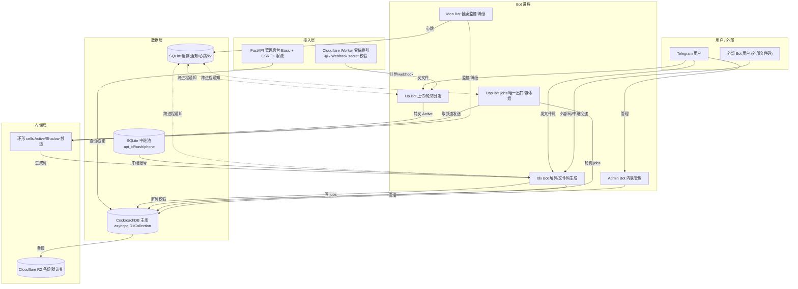

# TGJiema 架构评审报告

> 评审对象：`F:\xiangmu\tgjiema`（环形冗余 v2 高可用 Telegram 文件存储/解码/中继分发系统）
> 评审角色：架构师（高见远）
> 评审性质：**架构评审（Architecture Review）**，仅评估现有系统的架构健康度、设计质量、跨模块一致性与系统性风险，**不修改任何代码**。
> 方法：通读模块职责边界，并**逐条抽查核实**高危/中危发现的真实行号与代码路径（报告内标注 `文件:行号` 均为实地核对结果）。

---

## 0. 评审范围与方法

- **范围**：5 个 Bot 进程（Up / Idx / Dsp / Mon / Admin）、FastAPI Web 后台、Cloudflare Worker、数据层（CockroachDB + 本地 SQLite + 中继池）、存储层（R2）、部署（run_all / systemd×3 / supervisor / Docker）、utils。
- **方法**：模块职责边界分析 + 关键路径代码抽查（重点核实安全、数据完整性、并发、一致性类发现）。所有 P0/P1 行号均已实地打开源码确认；少量 Low 项来自既有探索结论，标记为"既有结论"。
- **结论概览**：系统**架构思路先进**（环形冗余 + 多进程容错 + 参数化查询 + 配额原子预扣），但在**认证统一性、备份可恢复性、查询语义正确性、部署闭环**上存在系统性缺口。其中 4 项为高危（P0），应立即止血。

---

## 1. 架构总览

### 1.1 系统拓扑

> 完整可渲染版本见 `docs/system_topology.mermaid`。

### 1.2 核心数据流

1. **上传 → 存储 → 编码**
   用户发文件给 **Up Bot** → 转发到 Active 存储频道（轮转分发）→ **Idx Bot** 监听生成文件码并写 `jobs` 表。
2. **解码 → 分发（环形）**
   用户发文件码给 **Idx Bot** → 做配额/限速/force-join 校验 → 写 `jobs` → **Dsp Bot** 作为**唯一出口**轮询 `jobs` → 从环形 cells 取频道发送（媒体组 `copy_messages` 保序）。
3. **外部码中继**
   外部码经 **中继池**（本地 SQLite 存 `api_id/api_hash/phone` 敏感凭证，与 CRDB 双向同步）→ 其它 bot 代为查询/投递。
4. **健康与运维**
   **Mon Bot** 监控频道健康并自动降级；**Admin Bot** 内联管理；**FastAPI 后台** 远程查询；**CF Worker** 零依赖引导 + webhook secret 校验。

---

## 2. 逐模块架构评估

| 模块 | 设计质量 | 职责边界 | 耦合度 | 主要问题 |
|---|---|---|---|---|
| **bots/** | 中 | 5 进程单一职责清晰（上传/解码/分发/监控/管理分离） | 中（经 CRDB jobs + SQLite 通知解耦，合理） | Idx 过大（≈2165 行）；鉴权点不统一（P0-1）；mon_bot 停止事件分裂（P1-15） |
| **services/** | 中上 | relay 池、监控调度、备份恢复分层合理 | 中（存在跨模块私有属性耦合 L9） | 资源泄漏（P1-8）；回退偷更新（P1-9）；备份脱敏/注入（P0-2/3） |
| **database/** | 中上 | D1Collection 翻译层 + L1/SQLite 两级缓存 | 低（接口抽象好） | `$or` 语义缺陷（P1-11，正确性 bug）；遗留 print（P0-4） |
| **storage/** | 中 | R2 备份默认关闭（保守可取） | 低 | 备份本身有脱敏/注入问题（P0-2/3） |
| **utils/** | 中 | 工具函数职责单一 | 低 | force_join fail-open（P1-17）；媒体词表错配（P1-16） |
| **admin/** | 中上 | Web 后台认证/限流设计完整；Admin Bot 功能完整 | 中 | 明文凭证存储（P1-13/14）；Secure cookie 与部署脱节（P1-5） |
| **cf-workers/** | 高 | 零依赖引导 + webhook secret 校验 | 低 | 基本无问题（正面项） |
| **部署** | 中 | run_all 多进程+自动重启；systemd×3 + supervisor + docker 多形态 | — | Dockerfile 权限（P1-6）；TTL SQL 未执行（P1-7）；TLS 缺失（P1-5）；supervisor 注释错误（L10） |

**要点说明**：
- **bots**：进程级职责分离是优点，但 `idx_bot.py` 单文件 2165 行、承载解码/编码/中继/管理多职责，内部鉴权逻辑分散，导致出现了"外部中继路径做了白名单、内部中继摄入完全无鉴权"的不对称（P0-1）。这是**架构一致性**问题而非单点 bug。
- **database**：D1Collection 把 Mongo 风格查询翻译为参数化 SQL，主体设计可取；但 `$or` 仅翻译 `$regex` 子条件、其余静默忽略（P1-11），属于**查询语义正确性**硬伤，会返回错误结果集而不报错。
- **admin**：Web 后台的 Basic 认证 + 双重提交 CSRF + 限流是本项目设计亮点；但管理面与 Bot 面都**明文存储敏感凭证**（P1-13/14），与"安全"整体基调相悖。

---

## 3. 跨切面系统性风险

### 3.1 安全模型
- **认证点不统一**：Up Bot 外部中继路径正确调用 `get_relay_whitelist`（`up_bot.py:849/937`），而 Idx Bot 的 `handle_relay_delivery`（`idx_bot.py:272`）与 `_handle_relay_file_media`（`idx_bot.py:1839`）**完全无鉴权**，攻击者对任意 `target_user_id` 未授权投递任意内部文件、绕过配额/限速/force-join（**全仓最严重漏洞，P0-1**）。
- **fail-open 倾向**：`force_join.py` 对所有异常（含 NetworkError/TimedOut/BadRequest/Forbidden）一律 `return True` 放行（P1-17），Telegram API 抖动即全员绕过强制加群。
- **传输层未闭环**：CSRF Cookie `Secure=True`（`admin/__init__.py:527/552/622`）但部署脚本无 TLS，明文 HTTP 下写操作全 403 且凭据明文（P1-5）。
- **敏感数据落库**：`/relay_code`、`/set_r2` 明文存库并回显（P1-13）；备份脱敏后恢复致凭证失效（P0-3）。
- 正面：webhook secret 缺失即拒启（fail-closed）、admin 后台认证/CSRF 设计完整。

### 3.2 数据一致性（L1 缓存 + SQLite + CRDB 三者）
- **缓存幽灵解码**：`invalidate_code_entry` 用 `loop.create_task(...)` 无任务引用（P1-10），fire-and-forget 可能被 GC/异常静默丢失 → SQLite 持久化缓存未失效。
- **reset 不一致**：`factory_reset`（`handlers.py:729-806`）不清内存缓存/拓扑，且 CRDB config 不在清空列表 → 重启前仍可解码、本地 KV 与 CRDB 部分不一致（P1-14）。
- **查询错集**：`$or` 仅翻译 `$regex`（P1-11），错误结果集（正确性 bug）。
- **备份可恢复性破坏**：脱敏占位符写入 → 全量恢复后中继/R2 凭证不可用（P0-3）。
- 现状：依赖"最终一致"但缺乏超时/对账机制；三层存储（`D1Collection` 参数化 + L1 + SQLite 通知）的**骨架正确**，但边界失效路径未覆盖。

### 3.3 并发与资源
- **孤儿任务**：`relay_instance.shutdown()`（`relay_instance.py:1024`）不取消后台任务（cleanup/message_loop/settle/flush），`relay_pool.shutdown` 同理；`start()` 可重复创建 cleanup 循环（P1-8）。
- **缓存任务无引用**：见 3.2（P1-10）。
- 正面：跨进程 SQLite 通知 + 文件锁协调多进程，工程上解决了进程间协调难题。

### 3.4 配置与可观测性
- **配置误伤**：`_strip_inline_comments` 用 `re.sub(r'\s+#.*$','',value)` 对所有字符串值剥离 `#`（P1-12）→ 含 `#` 的密钥/Token 被截断；`extra="ignore"`（P1-12）使错拼环境变量静默失效。
- **无结构化日志**：大量无条件 `print()`（P0-4 / L1），PII 泄漏 + 日志噪声；`monitor.SystemMetrics.increment` 为空 stub（L3），指标形同虚设。
- 缺统一 metrics / tracing 导出。

### 3.5 部署与运维
- **Dockerfile 启动失败风险**：`COPY --from=builder /root/.local` 后 `USER app`（P1-6），非 root 用户无法遍历 `/root` → pip --user 包不可读 → 大概率启动失败。
- **TTL 隐患未闭环**：`disable_crdb_ttl.sql` 存在但**无任何部署脚本自动执行**（P1-7），行级 TTL 未关闭。
- **TLS 缺位**（P1-5）、**supervisor 注释命令错误**（L10，称 `run_all.py admin_bot` 启动 Web 后台，实际启动的是管理员 Bot）。
- **零测试**：`tests/` 仅 `__pycache__`，无 `.py`（P1-18）→ 所有变更无回归保护。

---

## 4. 关键问题优先级清单

> 行号均已实地核对（除标注"既有结论"）。**P0 需立即止血**。

### P0 — 立即修复（高危：安全 / 数据完整性）

| ID | 位置 | 问题 | 影响 | 修复方向 |
|---|---|---|---|---|
| P0-1 | `bots/idx_bot.py:272`（`handle_relay_delivery`）、`:1839`（`_handle_relay_file_media`，经 `_route_media:2022` / `handle_message:1891`） | 中继摄入接口**完全未鉴权**（对比 `up_bot.py:849/937` 有 `get_relay_whitelist`） | 攻击者可向任意 `target_user_id` 未授权投递任意内部文件，并绕过配额/限速/force-join；全仓最严重漏洞 | 在 Idx 中继入口复用 `get_relay_whitelist` 或共享 HMAC/签名；仅接受来自白名单 chat 的中继消息 |
| P0-2 | `services/db_backup.py:274,279,284-287`（`restore_from_backup`） | 表名/列名仅 `replace('"','""')`，**无白名单**（与同仓 `db_restore._ALLOWED_TABLES` 自相矛盾） | 篡改备份 JSON 即可 SQL 注入 | 复用 `_ALLOWED_TABLES` 白名单 + 列名走 `_validate_identifier`（已存在） |
| P0-3 | `services/db_backup.py:40-54`（`_redact_secrets`） | `api_hash/r2_secret_key/r2_access_key` 脱敏为 `***REDACTED***`，恢复时占位符写入 | 空库全量恢复后中继账号/R2 凭证不可用，备份"可恢复性"被破坏 | 备份保留凭证的加密副本（KMS/密钥管理），恢复时从 KMS/环境变量回填；不对凭证占位 |
| P0-4 | `database/session.py:25-27`（`_json_dumps`）、`:605-616`（`_safe_str`） | 遗留**无条件 `print()`**，每次 CRUD 把 `user_id/file_types/payload` 原文打到 stdout | PII/业务数据泄漏 + 高流量日志噪声 | 删除 print 或改 `logger.debug` 并脱敏 |

### P1 — 尽快修复（中危：设计 / 一致性 / 部署）

| ID | 位置 | 问题 | 影响 | 修复方向 |
|---|---|---|---|---|
| P1-5 | `admin/__init__.py:527/552/622` | CSRF Cookie `Secure=True`，但 3 套部署脚本均不配 TLS；`ADMIN_WEB_HOST=0.0.0.0` | 明文 HTTP 下写操作全 403 且凭据明文传输 | 部署脚本强制 TLS 反代 + 文档；或按请求 scheme 动态决定 `secure` |
| P1-6 | `Dockerfile:29,43` | 非 root 用户 `app` 无法访问 `/root/.local`（pip --user 安装路径） | `USER app` 后大概率启动失败 | builder 阶段用 `--prefix` 安装到非 root 可读路径，或 `COPY` 到 `/app/.local` 并 `chown` |
| P1-7 | `admin/migrations/disable_crdb_ttl.sql`（无引用） | 关闭 `decode_logs/jobs` 行级 TTL 的 SQL 从未被部署脚本自动执行 | 每小时百万 RU 隐患未闭环 | 部署脚本幂等自动执行该 SQL |
| P1-8 | `services/relay_instance.py:1024`（`shutdown`）、`relay_pool.shutdown` | `shutdown()` 不取消后台任务（cleanup/message_loop/settle/flush）；`start()` 可重复建 cleanup 循环 | 孤儿任务 / 资源泄漏 | 维护 `asyncio.Task` 引用，`shutdown` 中 `gather(cancel)`；`start` 去重 |
| P1-9 | `services/mon/scheduler.py`（`_fetch_new_messages` 回退路径） | 回退调用 `bot_instance.get_updates()` 会"偷走"运行 bot 的更新队列 | 主 dispatcher 漏收/重复收 | 回退路径不直接 `get_updates`，或限定 offset/timeout 避免与主 dispatcher 冲突 |
| P1-10 | `database/cache.py:159`（`invalidate_code_entry`） | `loop.create_task(store.delete(...))` 无任务引用，fire-and-forget | 任务被 GC/异常静默丢失 → 缓存未失效、幽灵解码 | 持有 task 引用 / `await` / 集中 task 跟踪器 |
| P1-11 | `database/session.py:853/888-897`（`count_documents`）、`:914/949-961`（`find`） | 遇 `$or` 仅翻译 `$regex` 子条件，其余条件**静默忽略且不报错** | 错误结果集（正确性 bug） | `$or` 子条件完整翻译所有操作符；非 `$regex` 也处理；空 `$or` 报错 |
| P1-12 | `config/settings.py:196`（`_strip_inline_comments`）、`:185`（`extra="ignore"`） | 正则对所有字符串值剥离 `#` 之后内容；`extra="ignore"` 使错拼变量静默失效 | 含 `#` 的密钥/Token 被截断；配置错拼无感知 | 仅对已知非密钥字段剥离，或支持引号包裹；`extra` 改 `forbid` |
| P1-13 | `bots/admin_bot/handlers.py:357-376`（`/relay_code`）、`:642-656`（`/set_r2`） | 明文存库并回显登录码 / 明文存 R2 密钥，无加密无掩码 | 敏感凭证泄漏 | 加密存储 + 回显掩码 |
| P1-14 | `bots/admin_bot/handlers.py:729-806`（`factory_reset`） | 不清内存缓存/拓扑；CRDB config 不在清空列表 | 重置后已删数据重启前仍可解码；本地 KV 与 CRDB 部分不一致 | reset 同步清缓存/拓扑，并纳入 CRDB config |
| P1-15 | `bots/mon_bot.py`（无 `_set_stop_event`）、`run_all.py:75` | mon_bot 不接入全局停止事件 | 关闭行为与其他 4 个 bot 分裂 | mon_bot 注册并监听 `_set_stop_event` |
| P1-16 | `utils/file_utils.py:18`（`voice`）vs `services/relay_instance.py:337`（`audio`）；code_generator 缺 `sticker` | 媒体类型词表语义错配 | 类型识别不一致、潜在解码/中继失败 | 统一单一媒体类型常量源 |
| P1-17 | `utils/force_join.py:13/24/28/32/36` | 对 NetworkError/TimedOut/BadRequest/Forbidden/Exception 一律 `return True` 放行 | Telegram API 故障时所有用户绕过强制加群（fail-open） | fail-closed 或细分：仅特定可恢复错误放行并记录告警 |
| P1-18 | `tests/`（仅 `__pycache__`，无 `.py`） | 全仓无任何测试源码 | 鉴权/配额/缓存一致性/降级/外部码 均无回归保护 | 引入 pytest，优先补鉴权与配额单测 |

### P2 — 择机整改（低危：质量 / 风格，既有结论）

- **L1** 多处遗留 debug `print`（`up_bot._json_dumps`、解码日志明文等）。
- **L2** 弃用 `asyncio.get_event_loop()` 在 `relay_instance` 多处（约 8 处）。
- **L3** `monitor.SystemMetrics.increment` 为空 stub（调用无效）。
- **L4** import 期副作用：`rate_limiter`/`dynamic_rate_limiter` import 时读 `settings`，配置未就绪即崩。
- **L5** `assert` 用于生产校验（`dynamic_rate_limiter:39`）。
- **L6** 命令路径 vs 交互对话路径校验/行为不一致（`relay_code` 格式校验、`relay_set_api` 是否立即登录）。
- **L7** 批次上传绕过权限/限速（`up_bot.py:285-323`）。
- **L8** 多个死/半死分支（`idx_bot` 外部媒体回退等）。
- **L9** 跨模块私有属性耦合（`db_backup`/`db_restore`/`scheduler` 读 `_client`/`_r2`/`_db`）。
- **L10** supervisor 部署示例注释命令错误（`run_all.py admin_bot` 启动的是管理员 bot，非 Web 后台）。

---

## 5. 修复路线图

> 原则：**止血优先、最小变更、不破坏现有行为**。标 ★ 者为可在不破坏现有行为前提下最小变更修复。

### 阶段一：止血（P0，建议 1–2 天内）
1. **P0-1 ★**（最高优先）：Idx 中继入口加鉴权（复用 `get_relay_whitelist` 或共享 HMAC）。纯加法，不破坏正常中继流。
2. **P0-2 ★**：`restore` 加表/列白名单（复用 `_ALLOWED_TABLES` + `_validate_identifier`）。纯加固，不改变正常恢复路径。
3. **P0-4 ★**：删除/降级 `session.py` 的 `print`。零风险。
4. **P0-3**：备份保留凭证加密副本 / 恢复时从 KMS 回填。需谨慎设计兼容字段，避免破坏现有备份格式（可加版本号兼容旧备份）。

### 阶段二：加固（P1，建议 1–2 周内）
- **传输/部署**：P1-5（TLS 反代 + `secure` 按 scheme）、P1-6（Dockerfile 路径）、P1-7（TTL SQL 自动执行）、P1-15（mon_bot 停止事件）★。
- **并发/资源**：P1-8（relay shutdown cancel）、P1-9（scheduler 回退）、P1-10 ★（cache task 引用）。
- **正确性（建议尽早）**：**P1-11 ★** `$or` 完整翻译——纯修改查询翻译逻辑，高风险收益比，建议进入阶段二早期。
- **配置**：**P1-12 ★**（注释剥离收窄 + `extra=forbid`）低风险高价值。
- **凭证/一致性**：P1-13（加密存储+掩码）、P1-14（factory_reset 一致性）、P1-16（媒体词表统一）、P1-17（force_join 改 fail-closed/细分）。
- **工程化基础**：**P1-18** 补测试（先覆盖鉴权与配额）。

### 阶段三：工程化（P2 + 结构性）
- 清理 L1–L10：print→logger、弃用 API 替换、stub 实现、消除 import 副作用、assert 改显式校验、命令/对话路径统一、死分支删除、私有属性解耦为接口。
- **结构性改进**：① 统一媒体类型常量模块；② 统一鉴权中间件（所有 bot 入口共享，消除 P0-1 类不对称）；③ 配置 schema 严格化（`extra=forbid`）；④ 结构化日志 + 指标导出（替换 L3 stub）；⑤ CI 强制跑测试。

---

## 6. 架构层面的正面评价（保持客观）

尽管存在上述缺口，系统有多处**值得保留与发扬**的设计决策：

1. **参数化查询基础扎实**：`D1Collection` 主体使用 `$1/$2` 占位符 + `_validate_identifier` 校验标识符，除表/列名（P0-2 缺口）外值全部参数化；这是抗注入的坚实基础，P0-2 仅是边界遗漏而非整体缺陷。
2. **配额原子预扣防 TOCTOU**：配额采用"先预扣后使用"的事务化设计，避免并发超发——并发安全思路正确。
3. **secret 默认 fail-closed**：Webhook secret 缺失即拒绝启动/请求（CF Worker），体现"默认拒绝"的安全基线。
4. **管理后台认证体系完整**：Basic 认证 + 双重提交 CSRF + 限流，是本项目安全设计亮点。
5. **环形冗余 v2 高可用思路清晰**：多频道 cells + 监控自动降级，架构目标明确、容错路径合理。
6. **进程级容错**：`run_all.py` 多进程 + 自动重启监控，单 bot 崩溃不影响整体。
7. **多进程协调工程化**：中继池与主库双向同步、跨进程 SQLite 通知（心跳/kv/通知），务实解决了无中心协调器的多进程难题。
8. **安全意识并非缺失**：Up Bot 外部中继路径已做 `get_relay_whitelist` 校验（`up_bot.py:849/937`）——说明团队**知晓**该威胁面，P0-1 是"内部摄入路径遗漏"而非"设计无安全认知"，修复成本低、风险可控。

---

### 附：交付物
- 本报告：`docs/architecture_review.md`
- 系统拓扑图（可渲染）：`docs/system_topology.mermaid`

> 注：本次评审**未修改任何源代码**，仅产出上述分析与建议文件。
