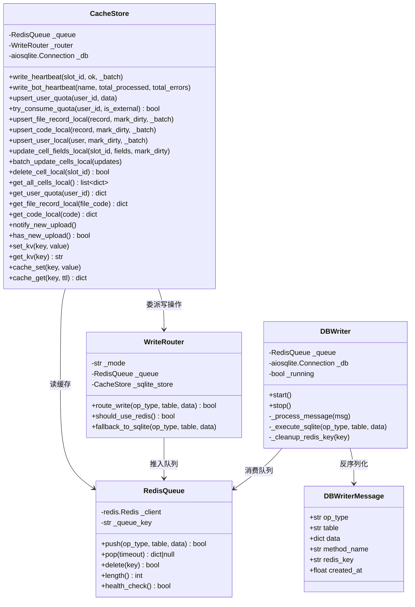
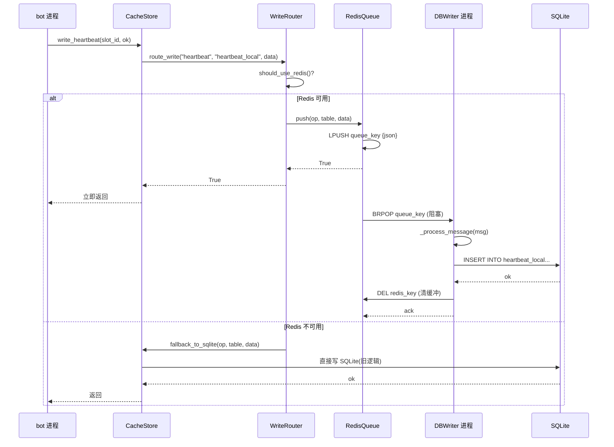
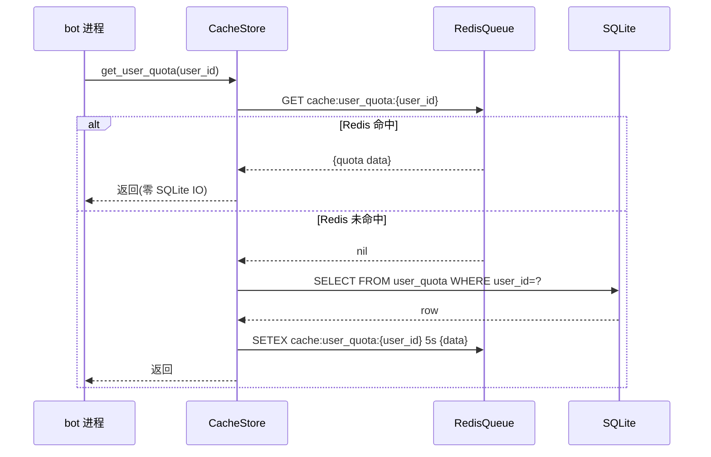
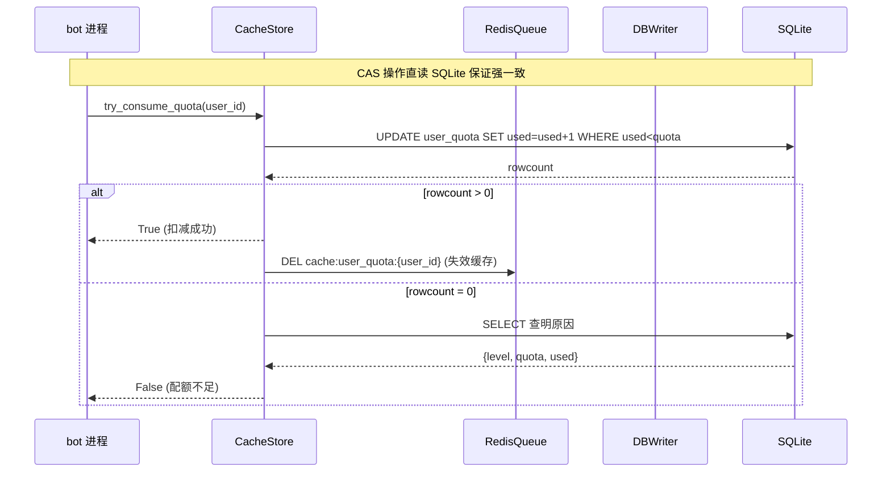

# 系统设计: Redis + Writer 进程架构

## 一、实现方案

### 1.1 核心架构

```
┌─────────────────────────────────────────────────────────────────┐
│  写入路径(异步, <0.1ms 返回)                                    │
│                                                                 │
│  up_bot ─┐                                                     │
│  idx_bot ─┤                                                     │
│  dsp_bot ─┼─> cache_store.write_xxx() ─> Redis LPUSH ─> 返回    │
│  mon_bot ─┤    (内部改造,调用方无感知)                          │
│  admin ──┘                                                      │
│                                                                 │
│  读路径(优先 Redis, 未命中回退 SQLite)                          │
│                                                                 │
│  up_bot ─┐                                                     │
│  idx_bot ─┤                                                     │
│  dsp_bot ─┼─> cache_store.read_xxx() ─> Redis GET ─> 命中?返回   │
│  mon_bot ─┤                        └─> 未命中 ─> SQLite SELECT  │
│  admin ──┘                            └─> 返回 + 回填 Redis     │
└─────────────────────────────────────────────────────────────────┘

┌─────────────────────────────────────────────────────────────────┐
│  落盘路径(串行, 零锁冲突)                                       │
│                                                                 │
│  Redis Queue ─> db_writer 进程 ─> SQLite INSERT/UPDATE ─> DEL  │
│  (BRPOP)       (systemd 服务)    (串行执行)           (清缓冲)  │
│                                      │                          │
│                                      └─> 异步同步 CRDB          │
│                                          (sync_dirty_*)         │
└─────────────────────────────────────────────────────────────────┘
```

### 1.2 框架选型理由

| 组件 | 选型 | 理由 |
|------|------|------|
| Redis 客户端 | `redis.asyncio` | 项目已用(`utils/redis_client.py`),无需新增依赖 |
| SQLite 驱动 | `aiosqlite`(保持不变) | Writer 进程独占连接,无并发冲突 |
| 进程模型 | systemd 独立服务 | 符合现有 7 服务架构 + 用户偏好 |
| 通信协议 | Redis List(LPUSH/BRPOP) | 简单可靠,天然 FIFO,支持阻塞等待 |
| 降级方案 | WRITER_MODE 环境变量 | redis 不可用时切回 SQLite 直写 |

### 1.3 缺点规避策略

| 缺点 | 规避方案 |
|------|---------|
| 双写一致性 | Writer 写完 SQLite 后 `DEL` Redis 缓冲 key,以 SQLite 为权威 |
| Writer 单点 | systemd `Restart=always` + Redis 队列积压告警(>1000) + 各 bot 写入失败暂存内存重放 |
| 读旧数据 | 关键数据(CAS/配额)直读 SQLite;非关键读 Redis + 短 TTL(5s) |
| 架构复杂度 | 封装在 `cache_store.py` 内部,对外接口不变 |
| Redis 宕机 | AOF 持久化 + 启动时从 SQLite 加载热数据 + WRITER_MODE=sqlite 降级 |

## 二、完整文件列表

### 2.1 新增文件

| 文件路径 | 用途 |
|---------|------|
| `database/db_writer.py` | Writer 进程主程序(BRPOP 消费 + SQLite 落盘) |
| `database/redis_queue.py` | Redis 队列封装(LPUSH/BRPOP/DEL/LEN) |
| `database/write_router.py` | 写操作路由器(决定走 Redis 还是直写 SQLite) |
| `tests/test_redis_writer.py` | 单元测试 |
| `tests/test_redis_writer_integration.py` | 集成测试 |
| `tests/test_redis_writer_consistency.py` | 一致性测试 |

### 2.2 修改文件

| 文件路径 | 改动范围 |
|---------|---------|
| `database/cache_store.py` | 所有写方法内部改走 `write_router`,读方法加 Redis 缓存层 |
| `config/settings.py` | 新增 `WRITER_MODE`、`WRITER_QUEUE_KEY`、`WRITER_BATCH_SIZE` 配置 |
| `run_all.py` | `BOT_RUNNERS` 新增 `db_writer` 条目 |
| `deploy_vps_per_bot.sh` | `SERVICES` 数组新增 db_writer 条目 |
| `.env.example` | 新增 `WRITER_MODE`、`WRITER_QUEUE_KEY`、`WRITER_BATCH_SIZE` |
| `bots/mon_bot.py` | `_check_alerts` 新增 Redis 队列积压监控 |

## 三、数据结构 + 接口

### 3.1 类图



### 3.2 序列图: 写入流程



### 3.3 序列图: 读取流程



### 3.4 序列图: CAS 操作(配额扣减)



## 四、关键调用流程

### 4.1 写操作分类与路由策略

| 操作类型 | 方法示例 | 路由策略 | 理由 |
|---------|---------|---------|------|
| 普通写(可异步) | write_heartbeat, upsert_file_record, set_kv | → Redis Queue | 容忍秒级延迟,追求低延迟 |
| CAS 写(需原子) | try_consume_quota, mark_local_job_dispatched | → 直写 SQLite | 需要立即知道 rowcount 结果 |
| 事务写(需原子) | batch_update_cells_local, delete_cell_local | → 直写 SQLite | 需要事务保证多行一致性 |
| 通知写(可异步) | notify_new_upload, notify_relay_change | → Redis Pub/Sub | 替代 SQLite notify 表,更轻量 |
| 批量写(可异步) | bulk_upsert_cells_local, bootstrap_* | → Redis Queue(分批) | 大批量拆分入队 |

### 4.2 读操作缓存策略

| 数据类型 | Redis 缓存 | TTL | 理由 |
|---------|-----------|-----|------|
| user_quota | 是 | 5s | 配额高频读,容忍 5s 延迟 |
| file_record | 是 | 30s | 文件记录读频率中等 |
| code_local | 是 | 30s | 同上 |
| cells_local | 是 | 10s | 拓扑变更需快速感知 |
| bot_heartbeat | 是 | 5s | 仪表盘高频读 |
| counter_snapshot | 否 | - | 直接读 Redis INCR(已原生) |
| CAS 相关 | 否 | - | 强一致需求,直读 SQLite |

## 五、任务列表(按依赖排序,≤5 个)

### 任务 1:项目基础设施(配置 + Redis Queue + 降级框架)

**文件**: `config/settings.py`, `database/redis_queue.py`, `database/write_router.py`, `.env.example`

**内容**:
- `settings.py` 新增 `WRITER_MODE`, `WRITER_QUEUE_KEY`, `WRITER_BATCH_SIZE` 字段
- `.env.example` 新增对应配置项
- `redis_queue.py` 封装 LPUSH/BRPOP/DEL/LLEN/health_check
- `write_router.py` 实现 `should_use_redis()` + `route_write()` + `fallback_to_sqlite()`
- 降级逻辑:REDIS_URL 为空或 Redis 不可达时自动降级

### 任务 2:DBWriter 进程(消费 + 落盘 + 优雅关闭)

**文件**: `database/db_writer.py`, `run_all.py`

**内容**:
- `db_writer.py` 实现 BRPOP 消费循环 + SQLite 串行写入 + DEL 缓冲 key
- 消息格式定义(DBWriterMessage dataclass)
- 信号处理:SIGTERM 触发优雅停止(消费完当前消息后退出)
- `run_all.py` 新增 `run_db_writer()` + `BOT_RUNNERS["db_writer"]` 条目
- 多进程模式注册 + 独立模式支持

### 任务 3:CacheStore 改造(写方法路由 + 读方法缓存)

**文件**: `database/cache_store.py`

**内容**:
- 所有写方法内部调用 `write_router.route_write()`
- CAS 写和事务写保持直写 SQLite(不变)
- 读方法加 Redis 缓存层(命中返回,未命中回退 SQLite + 回填)
- 跨进程通知改为 Redis Pub/Sub(notify_new_upload 等)
- 批量方法(bulk_upsert)拆分入队

### 任务 4:部署 + 监控(services + 部署脚本 + 告警)

**文件**: `deploy_vps_per_bot.sh`, `bots/mon_bot.py`

**内容**:
- `deploy_vps_per_bot.sh` SERVICES 数组新增 db_writer 条目
- systemd 服务定义(复用 generate_service 模板)
- `tgjiema.target` Wants 列表追加 db_writer
- mon_bot `_check_alerts` 新增 Redis 队列积压监控
- 启动顺序:redis → db_writer → 其他 bot

### 任务 5:测试(单元 + 集成 + 一致性)

**文件**: `tests/test_redis_writer.py`, `tests/test_redis_writer_integration.py`, `tests/test_redis_writer_consistency.py`

**内容**:
- 单元测试:RedisQueue LPUSH/BRPOP/DEL 原子性
- 单元测试:WriteRouter 降级逻辑
- 集成测试:Writer 进程消费 + SQLite 落盘 + DEL 缓冲
- 一致性测试:Writer 崩溃后 Redis 队列不丢数据
- 一致性测试:CAS 操作直读 SQLite 保证强一致
- 一致性测试:降级模式与 Redis 模式行为一致
