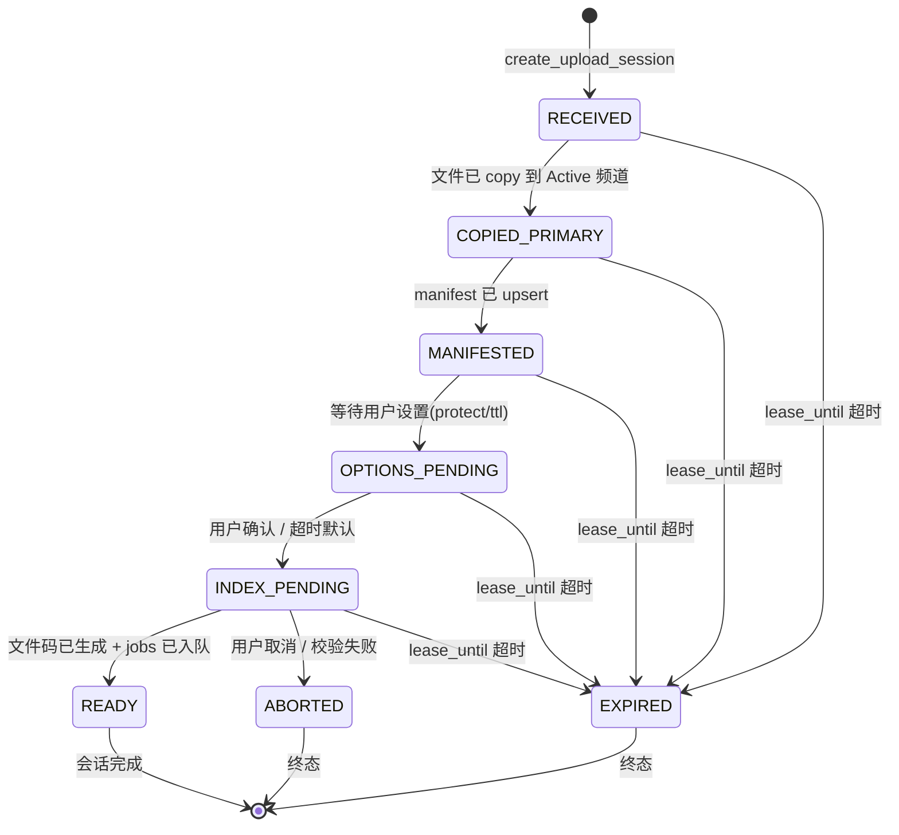
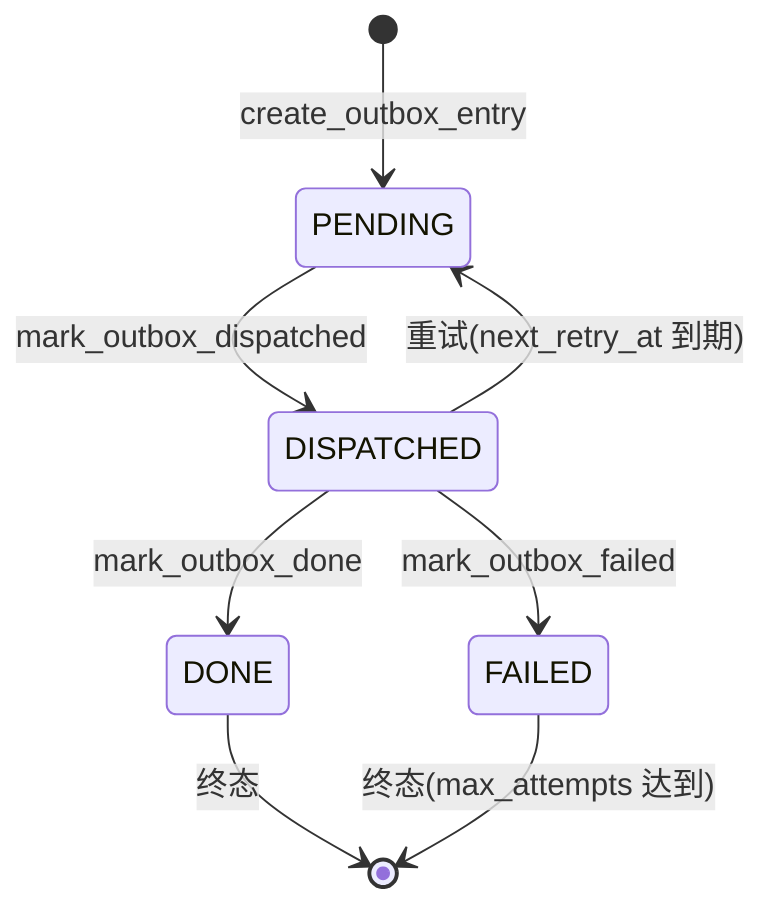
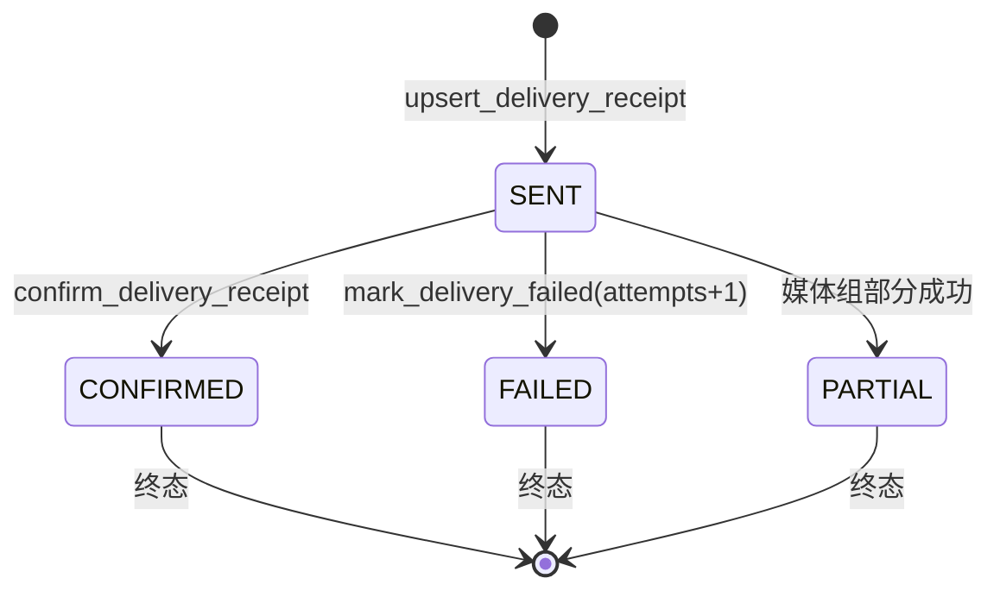
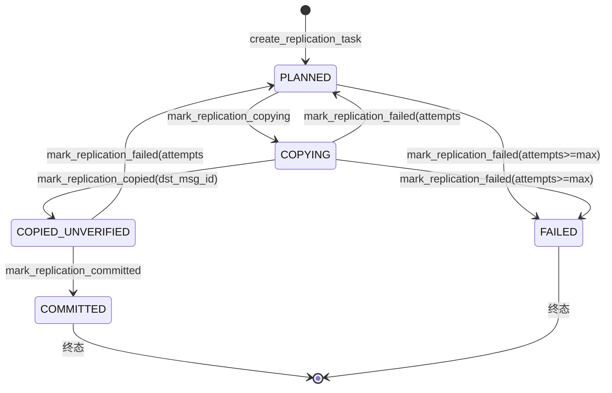
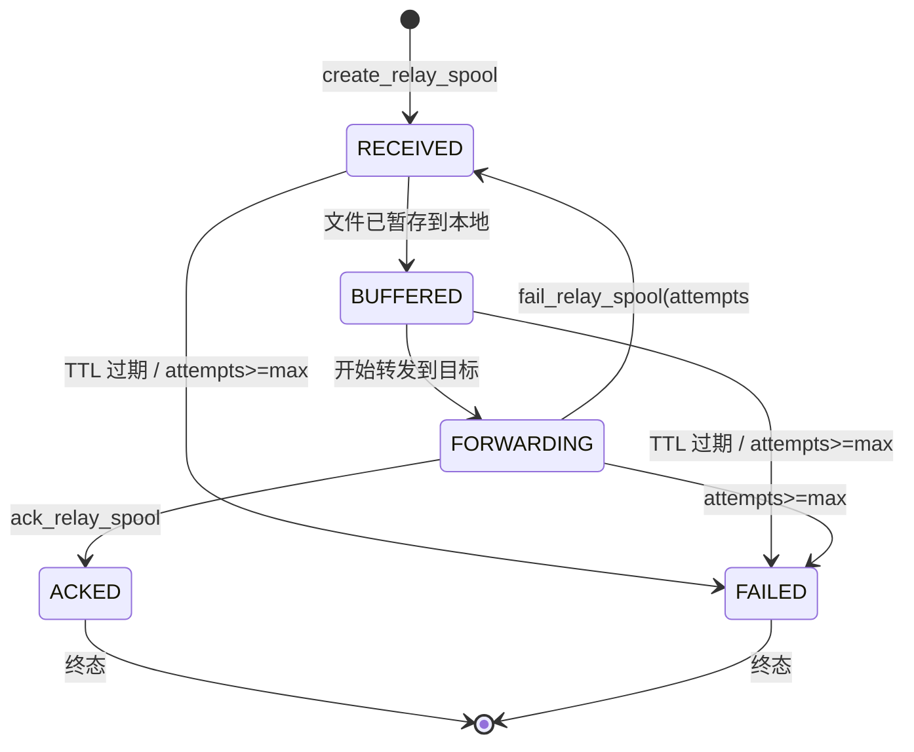
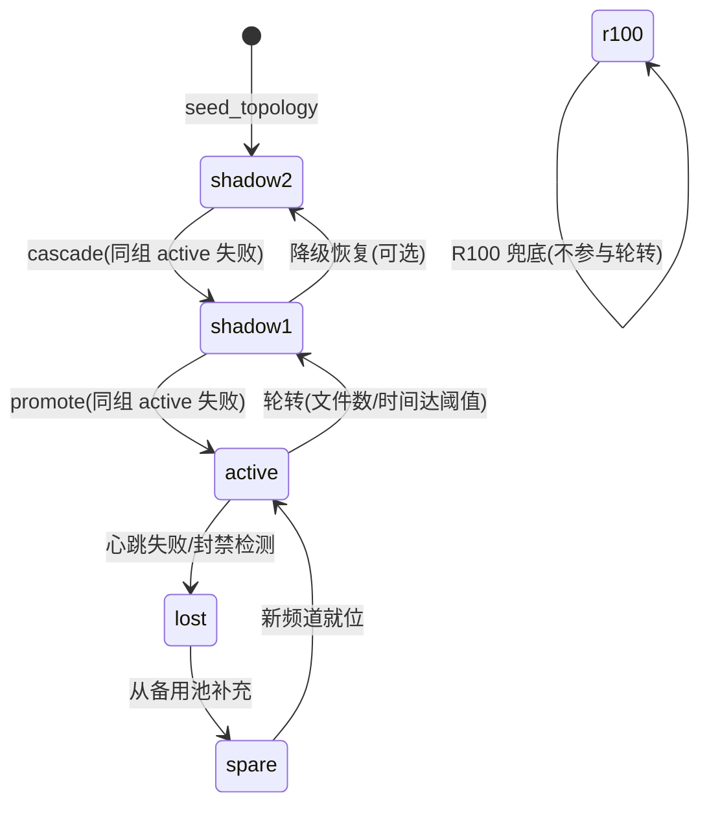
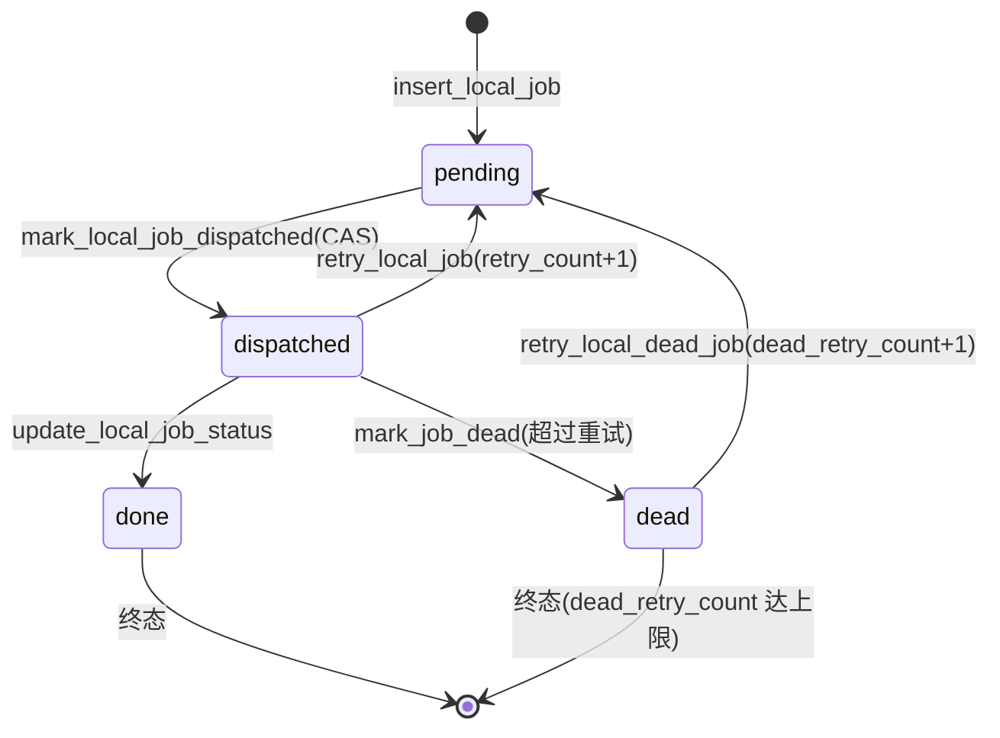
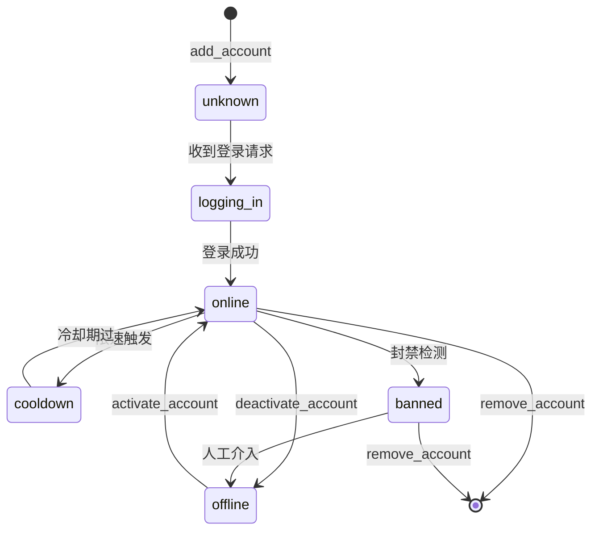

# tgjiema 状态机定义(单一事实源)

> 最后更新: 2026-07-12 | DDL_VERSION: 7

本文档定义所有持久化状态机的合法状态、转换条件与不变式。状态字段均为 TEXT 类型,转换必须通过 cache_store 提供的 `transition_*` / `mark_*` 方法(CAS 原子)。

## 1. upload_sessions 状态机

**Owner**:up_bot | **表**:SQLite `upload_sessions`(主键 `upload_id TEXT`)



**状态说明**:
- `RECEIVED`:已收到用户文件,等待 copy 到 Active 频道
- `COPIED_PRIMARY`:已写入 Active 频道,等待 manifest 登记
- `MANIFESTED`:manifest 已写入,等待用户选项确认
- `OPTIONS_PENDING`:用户可设置 protect_content / file_ttl_days
- `INDEX_PENDING`:已确认选项,等待生成文件码 + 入队 jobs
- `READY`:文件码已生成,会话完成
- `ABORTED`:用户主动取消或文件校验失败
- `EXPIRED`:租约超时(UPLOAD_SESSION_LEASE_SECONDS=300s)

**转换方法**:`transition_upload_session(upload_id, new_status, reason, **fields)` 原子 UPDATE。
**清理**:`cleanup_expired_sessions()` 将 lease_until < now 的非终态置 EXPIRED。

## 2. upload_outbox 状态机

**Owner**:up_bot(写) / dsp_bot(消费) | **表**:SQLite `upload_outbox`(主键 `outbox_id TEXT`)



**配置**:
- `UPLOAD_OUTBOX_MAX_ATTEMPTS=5`:最大重试次数
- `UPLOAD_OUTBOX_RETRY_DELAY=60`:重试延迟(秒)

**查询**:`get_pending_outbox()` 查询 `status='PENDING' AND (next_retry_at IS NULL OR next_retry_at <= now)`。

## 3. quota_ledger 事件类型

**Owner**:idx_bot | **表**:SQLite `quota_ledger`(自增主键 `ledger_id INTEGER`)

追加式日志表,不可更新,仅追加(event_type + before/after)。

| event_type | 触发条件 | quota_before | quota_after | is_external |
|-----------|---------|--------------|-------------|-------------|
| `consume` | 用户解码文件,配额 -1 | N | N-1 | 0(内部) |
| `consume` | 外部码解码,ext_used +1 | N | N(外部独立计数) | 1 |
| `refund` | 投递失败退还配额 | N | N+1 | 0 |
| `sync` | 后台 SQLite→CRDB 同步快照 | N | N | 0 |
| `reset` | 跨日重置(UTC 0点) | N | 0 | 0/1 |
| `expire` | 管理员手动过期 | N | 0 | 0/1 |

**保留期**:`QUOTA_LEDGER_RETENTION_DAYS=90` 天。
**索引**:`idx_quota_ledger_user(user_id, created_at)` + `idx_quota_ledger_request(request_id)`。

## 4. delivery_receipts 状态机

**Owner**:dsp_bot | **表**:SQLite `delivery_receipts`(自增主键 `receipt_id INTEGER`)



**唯一约束**:`UNIQUE(job_id, source_msg_id)` 防止同一消息重复投递。
**保留期**:`DELIVERY_RECEIPT_RETENTION_DAYS=30` 天。
**关联**:替代内存态 `_sent_msg_tracker`,崩溃恢复后从表中重建已投递 msg_id 集合。

## 5. replication_tasks 状态机

**Owner**:mon_bot | **表**:SQLite `replication_tasks`(自增主键 `task_id INTEGER`)



**配置**:
- `REPLICATION_TASK_MAX_ATTEMPTS=3`:最大重试次数
- `REPLICATION_TASK_RETRY_DELAY=60`:重试延迟(秒)
- `REPLICATION_BATCH_SIZE=30`:批量大小

**唯一约束**:`UNIQUE(group_id, file_unique_id, src_channel_id, dst_channel_id)` 防重复任务。
**失败逻辑**(`mark_replication_failed`):
```sql
status = CASE WHEN attempts + 1 >= max_attempts THEN 'FAILED' ELSE 'PLANNED' END
next_retry_at = CASE WHEN attempts + 1 >= max_attempts THEN NULL ELSE now + 60 END
```

## 6. relay_spool 状态机

**Owner**:up_bot(创建) / relay_pool(消费) | **表**:SQLite `relay_pool.db` `relay_spool`



**转换方法**:`transition_spool_status(spool_id, new_status, reason, **fields)` 原子 UPDATE,WHERE `status != new_status` 防重复。
**TTL 清理**:`cleanup_expired_spool(ttl_seconds=300)` 将 `status IN ('RECEIVED','BUFFERED') AND ttl_expires_at < now - ttl_seconds` 置 FAILED。
**失败累计**:`fail_relay_spool(spool_id, reason, max_attempts=3)`,达到上限才置 FAILED。

## 7. cells_local 状态机(含 CAS/fencing)

**Owner**:mon_bot(主控制面) / dsp_bot(降级补位控制面) | **表**:SQLite `cells_local`(主键 `slot_id TEXT`)

### 7.1 状态图



### 7.2 状态说明

| 状态 | 含义 | 写入者 |
|------|------|--------|
| `active` | 当前活跃槽位,接收上传 | mon_bot(轮转) / dsp_bot(降级) |
| `shadow1` | 一级影子,active 失败时立即提升 | mon_bot(cascade) |
| `shadow2` | 二级影子,shadow1 提升后晋升 | mon_bot(cascade) |
| `lost` | 已失败/封禁,等待备用池补充 | mon_bot(心跳检测) |
| `spare` | 从备用池拉取的新槽位,待初始化 | mon_bot(consume_spare) |
| `r100` | R100 兜底频道,全量归档,不参与轮转 | seed_topology |

### 7.3 CAS 合法转换矩阵

`cas_transition_cell(slot_id, expected_status, new_status, lease_owner, transition_id, **fields)`:
- WHERE `slot_id=? AND status=expected_status`,仅匹配时更新
- 成功时 `topology_version += 1`(fencing token)
- 写入 `lease_owner` / `lease_until` / `transition_id`

| expected_status → new_status | 允许的调用方 | 附加字段 |
|------------------------------|------------|---------|
| active → lost | mon_bot | degrade_count+1, next_active_chat_id=NULL |
| shadow1 → active | mon_bot | next_active_chat_id=<new>, degrade_count |
| shadow2 → shadow1 | mon_bot(cascade) | — |
| active → shadow1 | mon_bot(轮转) | rotation_started_at |
| lost → spare | mon_bot | channel_id=<new>, account_name |

### 7.4 租约互斥

- `acquire_cell_lease(slot_id, owner, lease_seconds=60)`:WHERE `lease_until < now OR lease_owner = owner`
- `release_cell_lease(slot_id, owner)`:WHERE `lease_owner = owner`(仅持有者可释放)
- 用于 mon_bot 长时间轮转操作和 dsp_bot 降级操作的互斥

## 8. local_job_queue 状态机

**Owner**:idx_bot(入队) / dsp_bot(消费) | **表**:SQLite `local_job_queue`(主键 `crdb_id INTEGER`,临时负数 ID 为本地未同步)



### 8.1 状态说明

| 状态 | 含义 | Owner |
|------|------|-------|
| `pending` | 待派工,等待 dsp 拉取 | idx(入队) / dsp(回退) |
| `dispatched` | 已派工,dsp 正在发送 | dsp |
| `done` | 已完成投递 | dsp |
| `dead` | 死信,超过重试上限 | dsp |

### 8.2 CAS 原子认领

```sql
UPDATE local_job_queue SET status='dispatched', dispatched_at=?
WHERE crdb_id=? AND status='pending'
```
WHERE 子句确保仅 pending→dispatched 成功,防止并发 worker 认领同一行。

### 8.3 崩溃恢复

- `reclaim_stale_dispatched(timeout=300s)`:将 `status='dispatched' AND dispatched_at < now - 300s` 的任务回退到 `pending`(不递增 retry_count)
- `retry_local_dead_job`:`dead` 状态任务在 `dead_retry_count < 上限` 时可手动重试
- 启动时 `sync_jobs_from_crdb_to_sqlite(limit=100)` 从 CRDB 拉取 pending 任务补充本地队列

### 8.4 关联 CRDB jobs 表状态

CRDB `jobs` 表状态(local_job_queue 的审计镜像):
- `pending` ↔ `pending`
- `dispatched` ↔ `dispatched`
- `done` ↔ `done`
- `dead` ↔ `dead`(含 dead_reason / dead_retry_count / dead_retry_at)

**同步方向**:
- 入队:SQLite 先写(主路径) → CRDB 异步 fire-and-forget(`_sync_new_job_to_crdb`)
- 状态回写:SQLite 状态变更 → `sync_local_jobs_to_crdb()` 每 120s 批量同步(按 status 分组 CASE WHEN)

## 9. relay_accounts 状态机

**Owner**:admin_bot / relay_pool | **表**:SQLite `relay_pool.db` `relay_accounts`(字段 `status TEXT`)



**更新方法**:`update_account_status(phone, status, info)` 写 status + status_info + status_updated_at。
**关联字段**:`relay_user_id` 记录登录成功后的 Telegram user_id,移除时用于清理白名单。
